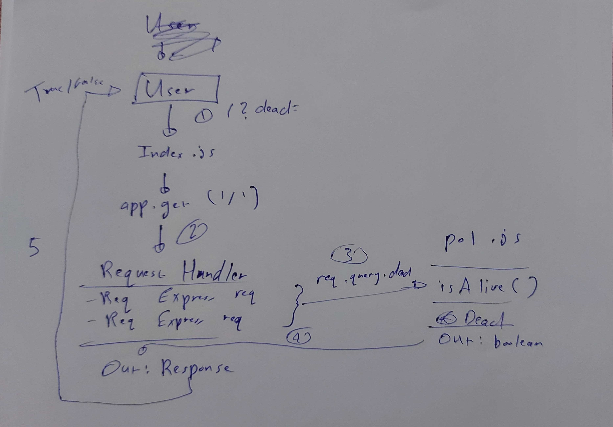

# LAB - 00

## Proof of Life Server

### Author: Ammar Badwan

### Links and Resources

- [submission PR](https://github.com/ammarBadwan-401-advanced-javascript/lab-00/pull/1)
- [ci/cd](https://travis-ci.org/github/ammarBadwan-401-advanced-javascript/lab-00/builds/687920939)
- [front-end application](https://ammar-lab00.herokuapp.com/)

#### Documentation
* [jsdoc](https://ammar-lab00.herokuapp.com/docs/)

### Modules
#### `pol.js`

#### Exported Values and Methods

#### `isAlive(dead) -> boolean`
Returns true/false to indicate how the server works.

### Setup
#### `.env` requirements
* `PORT` - Port Number

#### How to initialize/run your application (where applicable)

* `npm start`
* Endpoint: `/`
  * Returns a boolean
* Endpoint: `/docs`
  * Returns JSDoc Documenation Pages

#### How to use your library (where applicable)

#### Tests

* Unit Tests: `npm test`
* Lint Tests: `npm run lint`

#### UML

